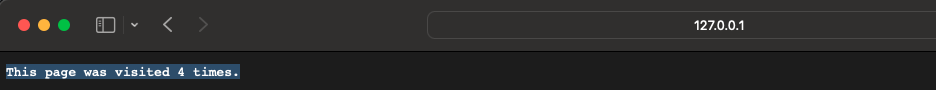

# Python Deployment

## Using HELM CMD

> helm install python web-app-svc -f python/value.yaml

## Using Kubernetes native CMD

> kubectl create -f App_Deployment/python_deploy.yaml

## Using HELM CMD

> helm install redis web-app-svc -f redis/value.yaml

## Using Kubernetes native CMD

> kubectl create -f App_Deployment/redis_deploy.yaml

# Testing the application

* Port forward the Python application service using the below command
    > kubectl port-forward service/python 8080:8080

* Open the browser using the localhost IP address with the forward port number
    > http://127.0.0.1:8080

* Application status after hitting the URL
    >
